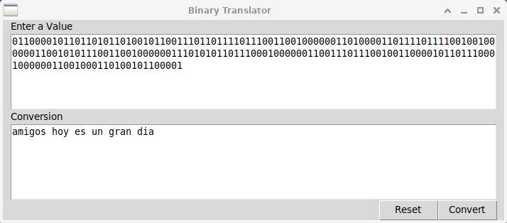

# GUI Binary Translator with Tkinter

Python tkinter GUI for a text-to-binary converter



## TODO:

### Improve
- [ ] Fix inter-object communication (binding GUI objects directly to commands on other objects is not optimal)
- [x] Create Binary to Text logic 

### Completed
- [x] Disable Output widget
- [x] Organize layour with classes
- [x] Translate Text to Binary


## Test locally:
1. clone this repo into a project folder and run translator.py
```
cd project-folder/
git clone https://github.com/westoleaboat/binary-translator-gui.git
cd binary-translator-gui/
python3 translator.py
```
